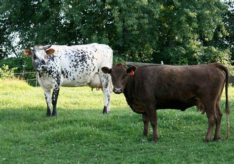
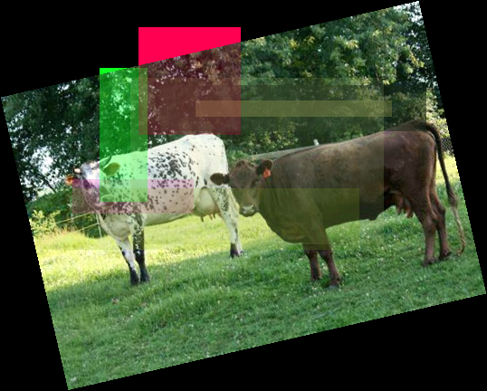
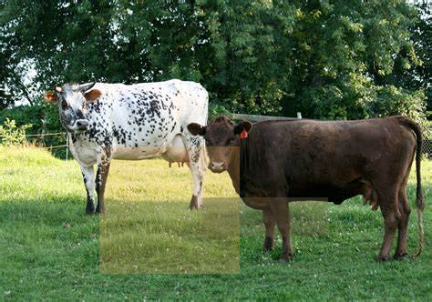

# ImageAugmentation
A quick tool I have made for an AI image recognition project to bloat training data. <br>
Simply changes the image rotation randomly, adds opace rectangles randomly throughout the image, and changes the contrast.<br>

## Usage
Place all your training images into ```BaseDirectory/Input``` <br>
Run Main.py<br>
Enter the amount of augmented images you want<br>
Let it augment many more images.

## Images
<p align="left">
  
</p>
<p align="left">
  
</p>
<p align="left">
  
</p>
<p align="left">
  
</p>
